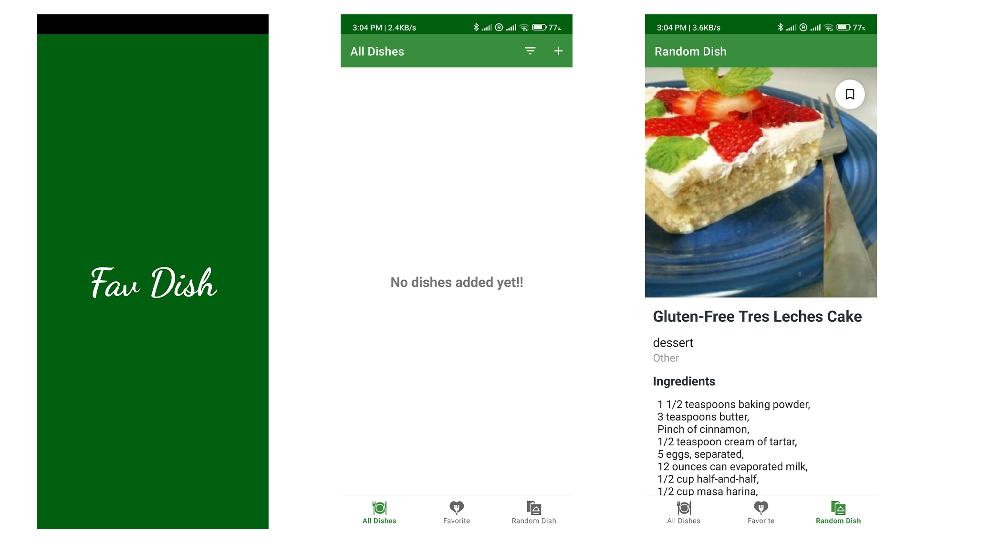
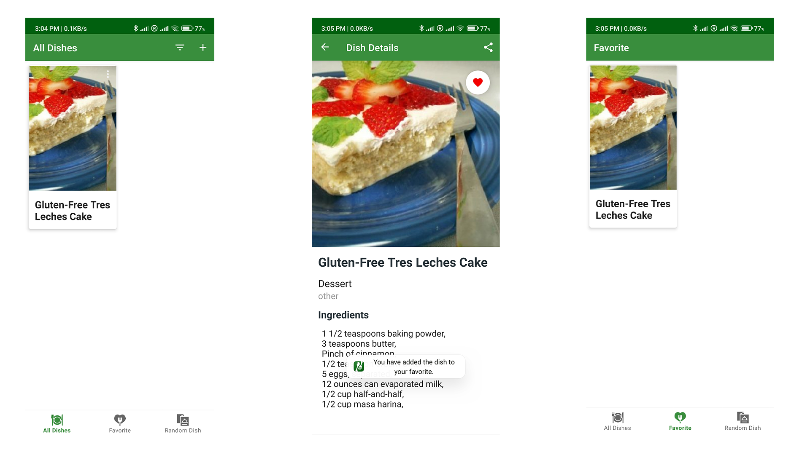

# FavDish App
It is an application that allows you to save your food recipes and also bring 
new food recipes randomly from the internet and save them or add them to 
favorites and also helps you edit them

## Screenshots

  

  

## Features

This ِApp contains four screens:

`ِAll Dishes Screen` It contains all your saved recipes and contains a list to add your own recipes   
`Favorite screen` it contains a list of your favorite dishes  
`Rnadome Dish Screen` It fetches a random food recipe from the internet and displays it to you and you can save it to your dishes 
`Details Screen` View recipe details, preparation method, processing, required time and others

## Main Features

* Kotlin
* XML
* JetPack
* Room Database
* MVVM
* Retrofit 2
* LiveData
* RxJava
* Glide
* Dexter

